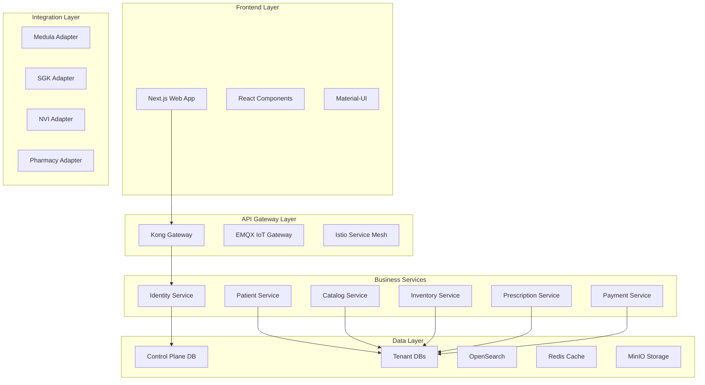

# 🏥 OPAS - Eczane Yönetim Platformu

> **Modern, ölçeklenebilir ve güvenli eczane yönetim sistemi**  
> 30,000+ eczane için tasarlanmış mikroservis mimarisi

[](https://dotnet.microsoft.com/download)
[](https://nextjs.org/)
[](https://postgresql.org/)
[](https://docker.com/)
[](https://opensource.org/licenses/MIT)

## 🚀 Özellikler

### 🏗️ **Mikroservis Mimarisi**
- **3-Tier Gateway**: Kong (API Gateway), EMQX (IoT Gateway), Istio (Service Mesh)
- **Event-Driven**: Redpanda/Kafka + RabbitMQ + Temporal + Debezium
- **Database-per-Tenant**: Her eczane için ayrı PostgreSQL veritabanı
- **Multi-Tenancy**: 30,000+ eczane desteği

### 🔐 **Güvenlik & Uyumluluk**
- **KVKK Uyumlu**: Veri gizliliği ve güvenlik standartları
- **Medula Entegrasyonu**: Sabit IP desteği ile güvenli bağlantı
- **NVI Kimlik Doğrulama**: Gerçek zamanlı TC kimlik kontrolü
- **2024 Güvenlik Standartları**: Modern şifreleme ve güvenlik protokolleri

### 📱 **Modern Kullanıcı Arayüzü**
- **Glassmorphism Tasarım**: Modern ve şık arayüz
- **Responsive Design**: Mobil, tablet ve masaüstü uyumlu
- **6-Adımlı Kayıt Süreci**: GLN doğrulama, NVI kontrolü, email/SMS doğrulama
- **Gerçek Zamanlı Doğrulama**: Anlık form validasyonu

### 🔧 **Teknik Özellikler**
- **Smart ID System**: PHM_XXXXXX, SUB_XXXXXX, TNT_XXXXXX
- **Outbox Pattern**: Güvenilir mesajlaşma
- **Idempotency**: Tekrarlanan işlemlerin güvenli işlenmesi
- **Dead Letter Queue (DLQ)**: Başarısız mesajların yönetimi

## 🏛️ **Mimari Yapı**



## 🛠️ **Teknoloji Stack**

### **Backend (.NET 8)**
- **ASP.NET Core** - Web API framework
- **Entity Framework Core** - ORM
- **PostgreSQL** - Ana veritabanı
- **Docker** - Containerization
- **OpenTelemetry** - Distributed tracing

### **Frontend (Next.js 14)**
- **React 18** - UI framework
- **TypeScript** - Type safety
- **Material-UI** - Component library
- **Emotion** - CSS-in-JS
- **Zustand** - State management

### **Infrastructure**
- **Kubernetes** - Container orchestration
- **Helm** - Package management
- **Istio** - Service mesh
- **Kong** - API gateway
- **EMQX** - IoT messaging

## 🚀 **Hızlı Başlangıç**

### **Gereksinimler**
- .NET 8.0 SDK
- Node.js 18+
- Docker & Docker Compose
- PostgreSQL 15+

### **Kurulum**

1. **Repository'yi klonlayın:**
```bash
git clone https://github.com/eczsavra/opas-mono.git
cd opas-mono
```

2. **Backend'i çalıştırın:**
```bash
# PostgreSQL container'ını başlatın
docker run --name opas-pg -e POSTGRES_PASSWORD=postgres -p 5432:5432 -d postgres:15

# Backend'i çalıştırın
cd src/Opas.Api
dotnet run
```

3. **Frontend'i çalıştırın:**
```bash
cd apps/web
npm install
npm run dev
```

4. **Veritabanını hazırlayın:**
```bash
# Migration'ları uygulayın
dotnet ef database update --project src/Opas.Infrastructure --startup-project src/Opas.Api
```

### **Erişim**
- **Frontend**: http://localhost:3000
- **Backend API**: http://localhost:5000
- **Swagger UI**: http://localhost:5000/swagger

## 📋 **Servis Kategorileri**

### **Core Business Services**
- `identity` - Kimlik doğrulama ve kullanıcı yönetimi
- `patient` - Hasta verileri ve kayıtları
- `catalog` - Ürün ve hizmet kataloğu
- `inventory` - Stok ve envanter yönetimi
- `prescription` - Reçete yönetimi
- `payment` - Ödeme işlemleri
- `notify` - Bildirim servisleri

### **BFF (Backend for Frontend)**
- `bff-web` - Web uygulaması backend'i
- `bff-pos` - Satış noktası backend'i

### **Integration & Adapters**
- `adapters/medula` - Medula entegrasyonu
- `adapters/sgk` - SGK entegrasyonu
- `adapters/eczane` - Eczane entegrasyonu
- `adapters/laboratuvar` - Laboratuvar entegrasyonu
- `adapters/radiology` - Radyoloji entegrasyonu

## 🔄 **Kayıt Süreci**

### **6-Adımlı Kayıt Akışı**

1. **GLN Doğrulama** - 13 haneli GLN numarası kontrolü
2. **Eczacı Bilgileri** - Ad, soyad, TC no, doğum yılı
3. **NVI Kimlik Doğrulama** - Gerçek zamanlı TC kimlik kontrolü
4. **Email Doğrulama** - Email adresi doğrulama kodu
5. **SMS Doğrulama** - Telefon numarası doğrulama kodu
6. **Kullanıcı Bilgileri** - Kullanıcı adı ve güvenli parola

### **Güvenlik Özellikleri**
- **2024 Parola Standartları**: Minimum 8 karakter, büyük/küçük harf, rakam, özel karakter
- **Rate Limiting**: API isteklerinde sınırlama
- **Input Validation**: Tüm girdilerin doğrulanması
- **SQL Injection Koruması**: Parametreli sorgular

## 🗄️ **Veritabanı Yapısı**

### **Control Plane Database**
- `pharmacist_admins` - Ana eczacı hesapları
- `sub_users` - Eczane çalışanları
- `tenants` - Eczane bilgileri
- `gln_registry` - GLN kayıtları
- `token_store` - API token'ları

### **Tenant Database (Her Eczane İçin)**
- Hasta kayıtları
- Reçete bilgileri
- Stok envanteri
- Satış geçmişi
- Raporlar

## 🔧 **Geliştirme**

### **Backend Geliştirme**
```bash
# Projeyi build edin
dotnet build

# Test'leri çalıştırın
dotnet test

# Migration oluşturun
dotnet ef migrations add MigrationName --project src/Opas.Infrastructure --startup-project src/Opas.Api
```

### **Frontend Geliştirme**
```bash
# Bağımlılıkları yükleyin
npm install

# Development server'ı başlatın
npm run dev

# Production build
npm run build
```

## 📊 **Monitoring & Observability**

- **OpenTelemetry** - Distributed tracing
- **Prometheus** - Metrics collection
- **Grafana** - Visualization
- **Jaeger** - Trace analysis
- **ELK Stack** - Centralized logging

## 🚀 **Deployment**

### **Docker Compose**
```yaml
version: '3.8'
services:
  opas-api:
    build: ./src/Opas.Api
    ports:
      - "5000:5000"
    environment:
      - ConnectionStrings__DefaultConnection=Host=postgres;Database=opas_control_plane;Username=postgres;Password=postgres
  
  opas-web:
    build: ./apps/web
    ports:
      - "3000:3000"
    environment:
      - NEXT_PUBLIC_BACKEND_URL=http://opas-api:5000
  
  postgres:
    image: postgres:15
    environment:
      - POSTGRES_PASSWORD=postgres
    volumes:
      - postgres_data:/var/lib/postgresql/data
```

### **Kubernetes**
```bash
# Helm ile deploy
helm install opas ./helm/opas

# Istio ile service mesh
kubectl apply -f k8s/istio/
```

## 🤝 **Katkıda Bulunma**

1. Fork yapın
2. Feature branch oluşturun (`git checkout -b feature/amazing-feature`)
3. Commit yapın (`git commit -m 'Add amazing feature'`)
4. Push yapın (`git push origin feature/amazing-feature`)
5. Pull Request oluşturun

## 📝 **Lisans**

Bu proje MIT lisansı altında lisanslanmıştır. Detaylar için [LICENSE](LICENSE) dosyasına bakın.

## 👥 **Takım**

- **Muhammed Erdem Arvas** - SuperAdmin & Lead Developer
- **OPAS Development Team** - Backend & Frontend Developers

## 📞 **İletişim**

- **Email**: info@opas.com.tr
- **Website**: https://opas.com.tr
- **GitHub**: https://github.com/eczsavra/opas-mono

---

<div align="center">

**🏥 OPAS - Eczane Yönetim Platformu**  
*Modern, güvenli ve ölçeklenebilir eczane yönetim sistemi*

[](https://github.com/eczsavra/opas-mono)
[](https://github.com/eczsavra/opas-mono)

</div>
