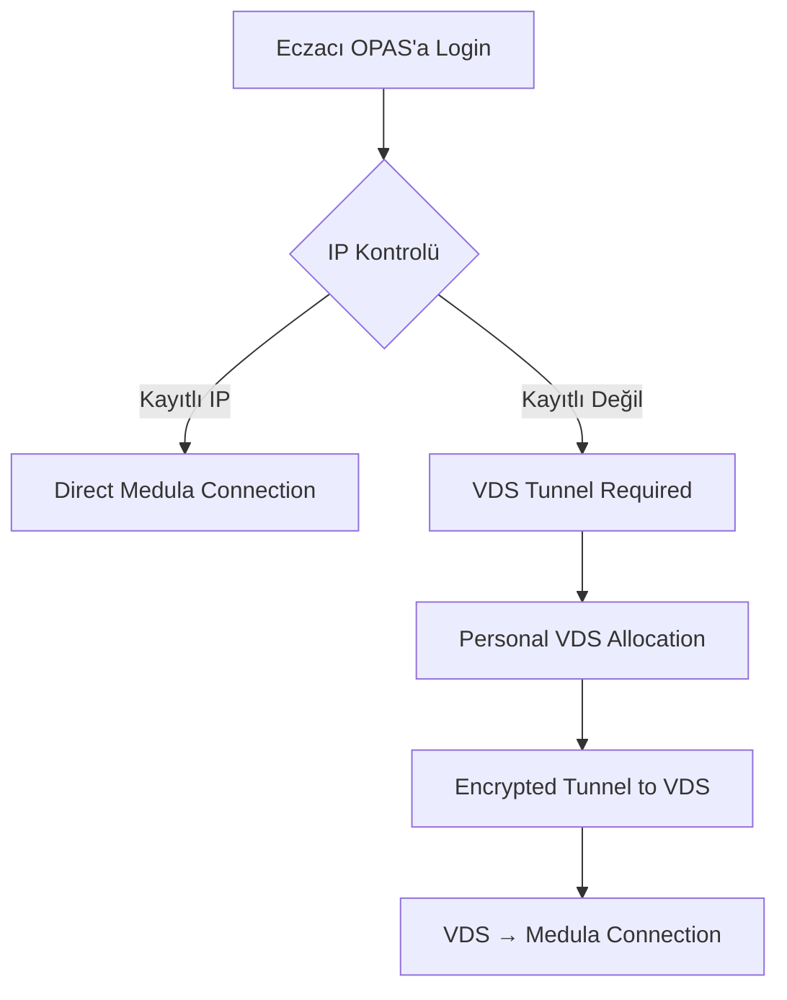

# 🏥 MEDULA ENTEGRASYONU - Teknik Dokümantasyon

> **Kritik Not**: Bu döküman Medula entegrasyonu için OPAS'ın stratejik yaklaşımını içerir.  
> Medula, devlete ait sistem olup özel IP gereksinimleri bulunmaktadır.

## 📋 **Medula Nedir?**

### **🎯 Temel Bilgiler**
- **Sahip**: T.C. Sağlık Bakanlığı / SGK
- **Amaç**: Eczane işlemleri (reçete, fatura, rapor)
- **Erişim**: Sadece web interface (API/WebService YOK)
- **Kritik**: Eczacılar için vazgeçilmez sistem

### **💊 Ana Fonksiyonları**
1. **Reçete Kaydetme**: E-reçete sistemi entegrasyonu
2. **Rapor Görüntüleme**: Hasta raporları, satış geçmişi
3. **Fatura Kesme**: SGK'ya otomatik faturalandırma
4. **İlaç İşlemleri**: Reçeteye ilaç ekleme/çıkarma
5. **Veri Parse**: İlaç bilgileri, hasta verileri

## 🔒 **IP Kısıtlamaları ve Güvenlik**

### **🚫 Katı Kurallar**
```
Medula Erişimi = Statik IP + SGK Kaydı (Eczacı Adına)
```

#### **✅ Gereklilikler:**
1. **Statik IP Zorunlu**: Dynamic IP ile erişim YOK
2. **SGK Kaydı**: IP, eczacının adına kayıtlı olmalı
3. **Limit**: Her eczacı maksimum **3 statik IP** hakkı
4. **Kişisel**: Başka eczacının IP'si kullanılamaz

#### **🏠 Tipik IP Dağılımı:**
```
Eczacı Ahmet'in IP Hakları:
├── IP #1: 🏥 Eczane (Ana iş yeri)
├── IP #2: 🏠 Ev (Evden çalışma) 
└── IP #3: 📱 Mobil/Yedek (Acil durumlar)
```

### **❌ Kısıtlamalar - Örnek Senaryo**
```
Eczacı Ahmet → Eczacı Mehmet'in eczanesini ziyaret ediyor
├── Eczacı Mehmet'in eczanesi: Statik IP mevcut
├── Eczacı Ahmet Medula'ya bağlanmak istiyor
└── ❌ BAŞARISIZ: IP Eczacı Mehmet adına kayıtlı!
```

## 🚀 **OPAS VDS Çözümü**

### **🎯 Temel Konsept**
OPAS, **shared VDS model** kullanarak eczacılara **ÜCRETSİZ** Medula erişimi sağlar.  
Her VDS'de **80 eczacı** barındırılarak maliyet optimize edilir.  
Bu VDS'ler **sadece Medula** ve benzeri statik IP gerektiren işlemler için kullanılır.

### **💎 Kritik Özellikler**
- **🇹🇷 Türkiye Lokasyon**: Kanuni gereklilik gereği TR datacenter
- **💰 ÜCRETSİZ Hizmet**: Kullanıcılar için ₺0/month (rakipleri ezip geçer!)
- **⚡ 80 Eczacı/VDS**: Optimal resource sharing (CPU/RAM/Disk limits)
- **🔄 Auto-scaling**: Peak hours'da otomatik kapasite artışı
- **🛡️ Container İzolasyonu**: Her eczacı isolated environment

### **🏗️ Shared VDS Mimari Yapısı**
```
┌─────────────────────────────────────────────┐
│           OPAS CLOUD (TÜRKİYE)              │
├─────────────────────────────────────────────┤
│  ┌─ TR-VDS-001 → 80 Eczacı (IP: X.X.1.x)   │
│  │   ├─ Slot-1: PHM_001 (IP: X.X.1.1)      │
│  │   ├─ Slot-2: PHM_002 (IP: X.X.1.2)      │
│  │   └─ ...80 slots                         │
│  ├─ TR-VDS-002 → 80 Eczacı (IP: X.X.2.x)   │
│  ├─ TR-VDS-003 → 80 Eczacı (IP: X.X.3.x)   │
│  └─ ...420 VDS = 30,000 Eczacı Total       │
├─────────────────────────────────────────────┤
│              ROUTING LAYER                  │
├─────────────────────────────────────────────┤
│               MEDULA SERVERS                │
└─────────────────────────────────────────────┘
```

### **⚡ Connection Flow**


## 🔄 **Bağlantı Modları**

### **📍 Mode A: Direct Connection**
```
Eczacı (Registered IP) → OPAS → Medula
```
- **Durum**: Ev/Eczane (kayıtlı IP'den)
- **Avantaj**: Hızlı, direct bağlantı
- **Gereksinim**: Statik IP + SGK kaydı

### **🌐 Mode B: VDS Tunnel**
```
Eczacı (Any IP) → OPAS → Personal VDS (Static IP) → Medula
```
- **Durum**: Dışarıda (kayıtlı olmayan IP'den)
- **Avantaj**: Her yerden erişim
- **Gereksinim**: OPAS VDS + SGK kaydı (VDS IP'si için)

## 🎛️ **OPAS Entegrasyon Detayları**

### **🔍 IP Detection Algorithm**
```typescript
interface MedulaAccessMode {
  mode: 'DIRECT' | 'VDS_TUNNEL'
  vdsRequired: boolean
  vdsId?: string
  staticIP?: string
}

async function detectMedulaAccess(
  userIP: string, 
  pharmacistId: string
): Promise<MedulaAccessMode> {
  // 1. Eczacının kayıtlı IP'lerini getir
  const registeredIPs = await getPharmacistRegisteredIPs(pharmacistId)
  
  // 2. Mevcut IP kayıtlı mı kontrol et
  if (registeredIPs.includes(userIP)) {
    return {
      mode: 'DIRECT',
      vdsRequired: false,
      staticIP: userIP
    }
  }
  
  // 3. VDS gerekli
  const vdsInfo = await getUserVDS(pharmacistId)
  return {
    mode: 'VDS_TUNNEL',
    vdsRequired: true,
    vdsId: vdsInfo.id,
    staticIP: vdsInfo.staticIP
  }
}
```

### **🖱️ User Interface Options**

#### **Option A: Auto Detection (Recommended)**
```jsx
// Otomatik IP tespiti ve yönlendirme
const handleMedulaAccess = async () => {
  const accessMode = await detectMedulaAccess(userIP, pharmacistId)
  
  if (accessMode.mode === 'VDS_TUNNEL') {
    // VDS tunnel kurulumu
    await establishVDSTunnel(accessMode.vdsId)
  }
  
  // Medula işlemlerine yönlendir
  router.push('/medula')
}
```

#### **Option B: Manual Selection**
```jsx
// Login ekranında "Dışarıdayım" butonu
<Button 
  variant="outlined" 
  onClick={() => setForceVDSMode(true)}
  startIcon={<LocationOffIcon />}
>
  📍 Dışarıdayım (VDS Kullan)
</Button>
```

#### **Option C: Smart Prompt**
```jsx
<Dialog open={showMedulaPrompt}>
  <DialogTitle>🏥 Medula İşlemi</DialogTitle>
  <DialogContent>
    <Alert severity="info">
      📍 Konumunuz: Kayıtlı olmayan IP<br/>
      🔧 Çözüm: VDS tunnel gerekli
    </Alert>
  </DialogContent>
  <DialogActions>
    <Button onClick={connectViaVDS}>VDS Üzerinden Bağlan</Button>
    <Button onClick={cancel}>İptal</Button>
  </DialogActions>
</Dialog>
```

## 👥 **Yetkilendirme ve Güvenlik**

### **✅ VDS Erişim Yetkileri**
```typescript
interface VDSAccess {
  allowedRoles: ['PharmacistAdmin']  // SADECE ana eczacı
  restrictedRoles: ['SubUser']       // Alt kullanıcılar YAPAMAZ
  requireMFA: boolean                // Çok faktörlü doğrulama
  sessionTimeout: number             // Oturum zaman aşımı
}
```

### **🛡️ Security Layers**
1. **Authentication**: OPAS login + MFA
2. **Authorization**: PharmacistAdmin role check
3. **Encryption**: VDS tunnel (VPN-like)
4. **Audit**: Tüm Medula işlemleri loglanır
5. **Session Management**: Timeout + activity tracking

## 🔧 **Teknik Implementasyon**

### **📦 Shared VDS Infrastructure**
```yaml
# TR VDS Specifications (Per VDS = 80 Eczacı)
shared_vds_config:
  cpu: 32 vCPU (0.4 vCPU per slot + burst)
  ram: 128GB (1.6GB per slot + shared)
  storage: 2TB NVMe SSD (25GB per slot)
  network: 10Gbps + Static IP Range (/27 subnet)
  location: Türkiye Datacenter (Legal Requirement)
  os: Ubuntu Server 22.04 LTS
  virtualization: Docker + Resource Limits
  software:
    - Container Runtime (Docker/Podman)
    - Nginx Load Balancer
    - Chrome Headless Cluster
    - Custom Medula Automation
    - Resource Monitoring (cAdvisor)
```

### **🔄 Per-Slot Resource Allocation**
```yaml
# Her Eczacı Slot'u (80 slot per VDS)
pharmacist_slot:
  resources:
    cpu_limit: 0.5 vCPU
    cpu_burst: 2 vCPU      # Peak hours için
    memory_limit: 2GB
    memory_swap: 1GB
    disk_limit: 30GB
    network_limit: 100Mbps
  isolation:
    type: container        # Docker container
    network: vlan_isolated # Network izolasyonu
    security: apparmor     # Security profilleri
```

### **🌐 Network Architecture**
```
Internet → OPAS Cloud → VDS Pool → Static IP Pool → Medula
   ↑           ↑          ↑            ↑           ↑
User IP    Load Balancer  VDS-001   X.X.1.1   gov servers
           Auto Scaling   VDS-002   X.X.1.2
                         VDS-003   X.X.1.3
```

### **🤖 Medula Automation Stack**
```typescript
// Medula browser automation with error handling
class MedulaAutomation {
  private browser: Browser
  private page: Page
  private pharmacistCredentials: MedulaCredentials
  
  async login(credentials: MedulaCredentials): Promise<void>
  async navigateToModule(module: MedulaModule): Promise<void>
  async fillForm(formData: any): Promise<void>
  async submitAndWait(): Promise<MedulaResponse>
  async extractData(selector: string): Promise<any>
  async handleCaptcha(): Promise<void>           // CAPTCHA çözümü
  async handleSessionTimeout(): Promise<void>    // Oturum timeout
  async handleMaintenance(): Promise<void>       // Bakım modu
  async retryWithBackoff(operation: Function): Promise<any>
  async logout(): Promise<void>
}

// Medula-specific error types
enum MedulaErrorType {
  CAPTCHA_REQUIRED = 'captcha_required',
  SESSION_EXPIRED = 'session_expired', 
  IP_BLOCKED = 'ip_blocked',
  MAINTENANCE_MODE = 'maintenance_mode',
  INVALID_CREDENTIALS = 'invalid_credentials',
  FORM_VALIDATION_ERROR = 'form_validation_error',
  NETWORK_TIMEOUT = 'network_timeout'
}
```

### **⚠️ Medula Özel Durumları**
```typescript
// Medula sistemindeki özel durumlar ve çözümleri
interface MedulaSpecialCases {
  captchaHandling: {
    detection: 'image_recognition' | 'manual_intervention'
    fallback: 'human_solver_service'
    timeout: 30000 // 30 seconds
  }
  
  sessionManagement: {
    maxIdleTime: 900000      // 15 minutes
    refreshInterval: 600000   // 10 minutes  
    multiTabPrevention: true  // Tek tab rule
  }
  
  ipRotation: {
    detectBlocking: true      // IP block detection
    autoRotate: true         // Backup IP'ye geçiş
    cooldownPeriod: 3600000  // 1 hour cooldown
  }
  
  maintenanceMode: {
    detection: 'page_content_analysis'
    retryInterval: 300000    // 5 minutes
    maxRetries: 12          // 1 hour total
    userNotification: true   // Kullanıcıyı bilgilendir
  }
}
```

## 📊 **Scaling ve Performance**

### **📈 Shared VDS Capacity Planning**
```
Target: 30,000 Eczacı
├── VDS Count: 420 (80 eczacı per VDS + %10 buffer)
├── Per VDS: 32 vCPU, 128GB RAM, 2TB SSD
├── Total Resources: 13,440 vCPU, 53TB RAM, 840TB Storage
├── Static IP Range: 420 × /27 subnets = ~13,440 IPs
├── Concurrent Users: ~5,000 peak (distributed across 420 VDS)
├── Location: Türkiye Datacenters (Legal Requirement)
└── Service Model: ÜCRETSİZ (Competitive Advantage)
```

### **💰 Economic Model**
```
MALIYET:
├── VDS Cost: 420 × ₺5,000/month = ₺2,100,000/month
├── Static IP: 13,440 × ₺50/month = ₺672,000/month  
├── Bandwidth: 420 × 10Gbps = ₺1,000,000/month
└── Total: ~₺3,772,000/month

KARŞILAŞTIRMA:
├── Dedicated Model: ₺15,000,000/month (30K VDS)
├── Shared Model: ₺3,772,000/month (420 VDS)
└── TASARRUF: %75 maliyet düşüşü! 💚

VALUE PROPOSITION:
├── Users: ÜCRETSİZ service (₺0/month)
├── Market: Rakipler ücretli, OPAS ücretsiz
└── Competitive Moat: FREE = Market Domination! 🚀
```

### **⚡ Optimization Strategies**
1. **VDS Pool**: Dynamic allocation vs dedicated
2. **Session Reuse**: Browser session persistence
3. **Caching**: Medula data caching (where possible)
4. **Load Balancing**: VDS cluster load distribution
5. **Auto Scaling**: Peak hours expansion

## 🚨 **Riskler ve Mitigation**

### **⚠️ Potential Risks**
1. **Medula Değişiklikleri**: UI değişimi automation'ı bozabilir
2. **IP Blocking**: Çok fazla request ban'a sebep olabilir
3. **Performance**: 30K user simultaneous load
4. **Legal**: Government automation compliance
5. **SGK Policy Changes**: IP politikası değişebilir
6. **Resource Contention**: 80 eczacı/VDS noisy neighbor problemi
7. **CAPTCHA Challenges**: Medula CAPTCHA sistemi automation'ı zorlaştırabilir
8. **Session Conflicts**: Aynı eczacı multiple location login
9. **Data Privacy**: KVKV compliance sağlama zorunluluğu

### **🛡️ Mitigation Plans**
1. **UI Change Detection**: 
   - Automated screenshot comparison
   - DOM structure monitoring
   - Fallback to manual intervention
   
2. **IP Management Strategy**:
   - Smart request throttling (per IP rate limiting)
   - Automatic IP rotation system
   - Multiple datacenter distribution
   
3. **Resource Management**:
   - Container resource limits (CPU/RAM quotas)
   - Priority queuing (peak hours management)
   - Auto-scaling triggers (load-based)
   
4. **Legal & Compliance**:
   - SGK official approval process
   - KVKV data protection audit
   - Automation usage transparency
   
5. **Technical Resilience**:
   - Multi-region failover (Istanbul, Ankara, Izmir)
   - Browser instance redundancy
   - Session state persistence
   
6. **Business Continuity**:
   - Manual fallback procedures
   - 24/7 technical support
   - Real-time monitoring alerts

## 📋 **Implementation Roadmap**

### **Phase 1: Foundation (1-2 hafta)**
- [ ] VDS infrastructure setup
- [ ] Static IP allocation
- [ ] Basic tunnel connectivity
- [ ] IP detection logic

### **Phase 2: Automation (2-3 hafta)**
- [ ] Medula browser automation
- [ ] Form filling & submission
- [ ] Data extraction
- [ ] Error handling

### **Phase 3: Integration (1-2 hafta)**
- [ ] OPAS UI integration
- [ ] User flow implementation
- [ ] Security hardening
- [ ] Performance testing

### **Phase 4: Production (1 hafta)**
- [ ] Load testing
- [ ] Security audit
- [ ] Go-live preparation
- [ ] Monitoring setup

## 🎯 **Next Steps**

### **🏗️ Infrastructure Decisions**
1. **Turkish VDS Providers**: Radore, Netinternet, Türk Telekom evaluation
2. **Static IP Range Procurement**: 13,440 IP bloğu negotiations
3. **Container Orchestration**: Docker Swarm vs Kubernetes selection
4. **Monitoring Stack**: Prometheus + Grafana + ELK setup

### **🔧 Development Priorities** 
5. **Medula Test Environment**: SGK sandbox credentials
6. **Browser Automation**: Selenium/Playwright architecture
7. **Session Management**: Browser context persistence
8. **Load Balancer**: Nginx/HAProxy configuration

### **📋 Compliance & Security**
9. **Legal Review**: Government automation compliance
10. **Security Audit**: Penetration testing (pre-production)
11. **KVKK Compliance**: Data protection measures
12. **SGK Coordination**: Official integration approval

### **🚀 Launch Strategy**
13. **Pilot Program**: 100 eczacı beta test
14. **Performance Benchmarks**: Load testing (5K concurrent)
15. **Marketing Campaign**: "FREE MEDULA ACCESS" strategy
16. **Support Infrastructure**: 24/7 technical support team

---

## 📞 **İletişim ve Destek**

- **Teknik Lead**: Muhammed Erdem Arvas
- **VDS Infrastructure**: Cloud Team
- **Medula Integration**: Integration Team
- **Security Review**: Security Team

---

## 💡 **Success Metrics & KPIs**

### **📊 Technical KPIs**
- **Availability**: >99.9% uptime (SLA target)
- **Performance**: <2s Medula login time
- **Scalability**: Support for 30K concurrent users
- **Resource Efficiency**: <80% VDS utilization per server

### **📈 Business KPIs** 
- **User Adoption**: 1K+ eczacı first month
- **Cost Reduction**: %75 infrastructure savings
- **Market Share**: %50+ eczane market penetration
- **Customer Satisfaction**: >4.5/5 user rating

### **🎯 Competitive Advantage Metrics**
- **FREE Service**: ₺0 vs ₺200-500 competitor pricing
- **Location Freedom**: %100 mobility vs %0 mobility
- **Setup Time**: <24h vs weeks (competitors)
- **Technical Support**: 24/7 vs business hours

---

## 🔍 **Glossary & Terms**

- **VDS**: Virtual Dedicated Server (Sanal Özel Sunucu)
- **Medula**: T.C. Sağlık Bakanlığı eczane sistemi
- **SGK**: Sosyal Güvenlik Kurumu
- **KVKV**: Kişisel Verilerin Korunması Kanunu
- **GLN**: Global Location Number (Eczane kimlik numarası)
- **Static IP**: Sabit IP adresi (dynamic'in karşıtı)
- **Container**: İzolasyon sağlayan virtualization teknolojisi
- **Automation**: Web tarayıcı otomasyonu (Selenium/Playwright)

---

## 📚 **Related Documentation**

- [OPAS Authentication System](./AUTH-SYSTEM.md)
- [Multi-Tenant Database Architecture](./DB-ARCHITECTURE.md) 
- [Container Orchestration Guide](./CONTAINER-GUIDE.md)
- [Security & Compliance](./SECURITY.md)
- [Performance Monitoring](./MONITORING.md)

---

> **⚠️ CRITICAL**: Bu sistem kritik altyapı gerektirmektedir.  
> Production'a geçmeden önce kapsamlı test, legal review ve SGK approval şarttır.
>
> **🎯 OPPORTUNITY**: Bu sistem OPAS'ı market leader yapacak kilit differentiator'dır.  
> FREE Medula access = instant market domination strategy! 🚀
